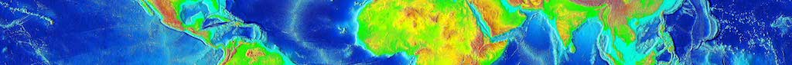

**Project Status (2019-07-17):** Local images build, containers run, application is usable over HTTPS but with critical bugs.

# Containerized, Multi-service, Open-Source CartoDB

This repository is intended to serve as a guide to packaging the open-source version of the <a href="https://carto.com/" target="_blank">CARTO</a> location intelligence platform for scalable deployment to cloud environments. The documents below should help you get started working with the project; for additional information you can consult the [project wiki](https://github.com/ruralinnovation/multi-svc-cartodb/wiki).

* [Project Overview](./DOCS/OVERVIEW.md) - _Description of this project, and how it decomposes the CARTO stack._
* [Installation](./DOCS/INSTALL.md) - _Local installation of this repo, and how to build the cluster for local development._
* [Configuration](./DOCS/CONFIGURATION.md) - _How the various services are configured._
* [Testing](./DOCS/TESTING.md) - _How to run tests for each component._
* [Operations](./DOCS/OPERATIONS.md) - _How the stack is architected and run._
* [Metrics](./DOCS/METRICS.md) - _How metrics are emitted and collected for each component._
* [Deployment](./DOCS/DEPLOYMENT.md) - _How to deploy built images to a cloud environment._
* [Optimization](./DOCS/OPTIMIZATION.md) - _How to tune a cloud deployment of CartoDB._
* [Contribution Guidelines](./CONTRIBUTING.md) - _Interested in helping? Look here first._
